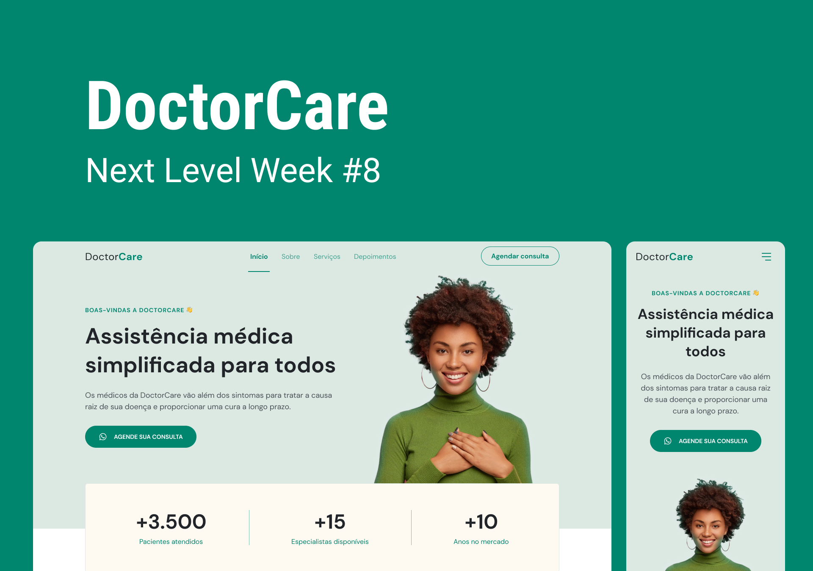

 
  

## 🖥️ Projeto
Esse é o projeto Web Responsivo de atendimento médico online.

## 🚀 Tecnologia
Esse projeto foi desenvolvido durante o NLW da Rocketseat com as seguintes tecnologias:

- HTML
- JavaScript
- CSS
- Git e Github

## 🏷️ Layout
Você pode vizualizar o layout do projeto através 
[desse link](https://www.figma.com/file/q3Nrg9jfpvhhoLkz97lyJZ/DoctorCare-(Community)?type=design&node-id=120-21&t=fKc6ye86vJ2lLfXx-0).
É necessário ter uma conta no [Figma](https://www.figma.com)